# webook
a book not for read

# assignment

## week2

### edit

+ 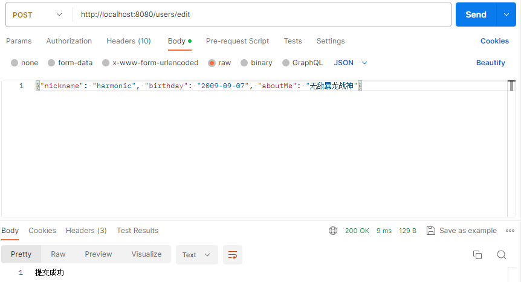
+ 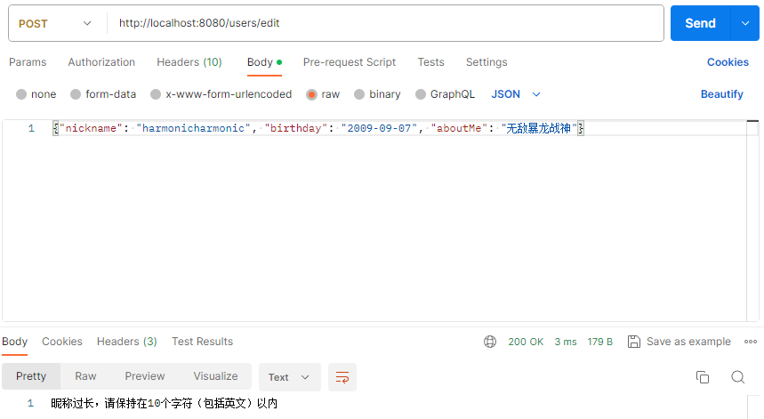

### profile

+ 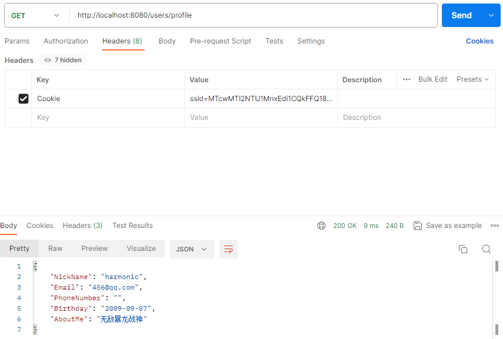

## week3

+ 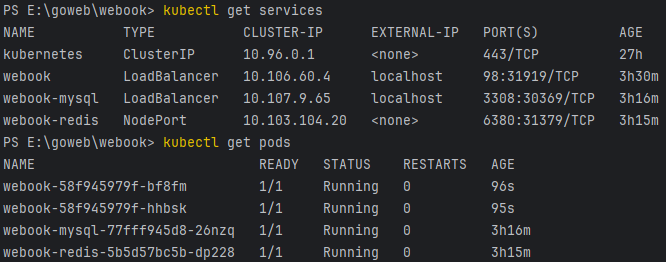
+ 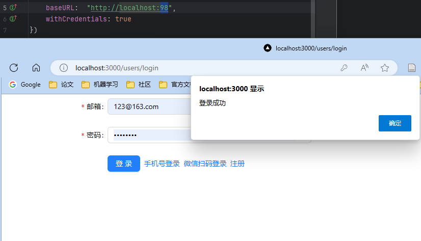
+ 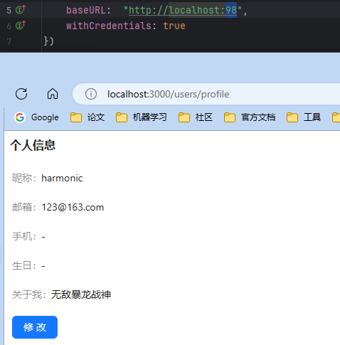

## week6

+ 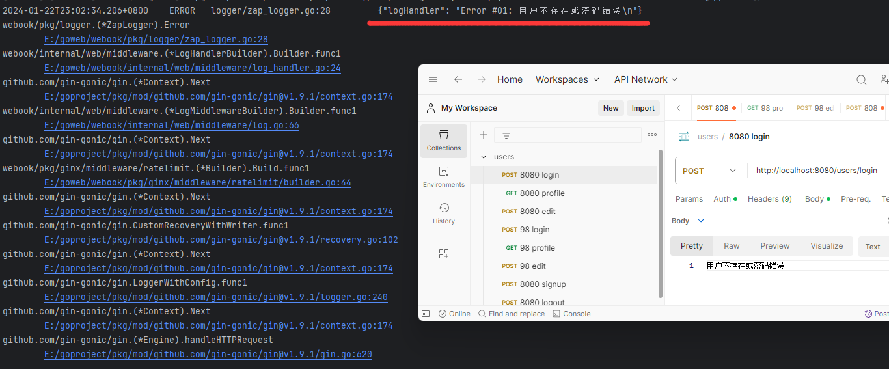

  

### 思路

+ 创建一个为handler打印log的中间件

  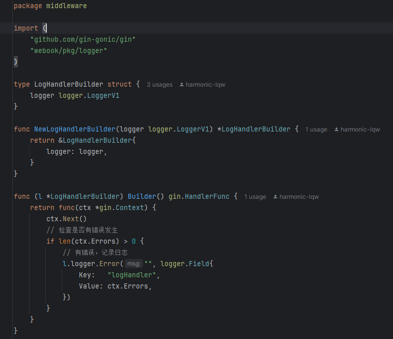

+ 在初始化中添加中间件

  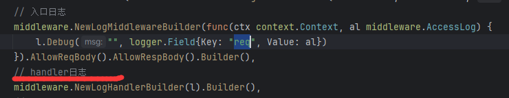

+ 每次 `err != nil`时，在上下文的err列表中添加err， 最后中间件会自动检测err并打印日志

  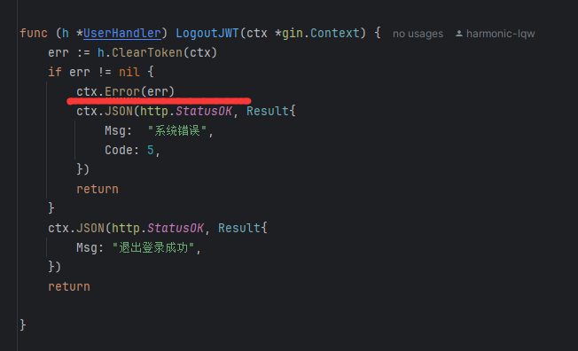

## week10

### 具体修改的文件

+ 将 `internal/events/article` 下的 `producer` 和 `consumer` 集成 `vector`，并修改 `ProduceReadEvent` 和 `Consume` 方法的代码
+ [webook/internal/events/article/producer.go at main · harmonic-lqw/webook (github.com)](https://github.com/harmonic-lqw/webook/blob/main/internal/events/article/producer.go)
+ [webook/internal/events/article/consumer.go at main · harmonic-lqw/webook (github.com)](https://github.com/harmonic-lqw/webook/blob/main/internal/events/article/consumer.go)

### 统计指标

+ `summary` ，并以 `topic` 区分业务，因为比较关心生产一条消息和消费一条消息的时间

### 告警思路

+ 在生产耗时和消费耗时的差距设置告警，如果消费耗时比生产耗时高出某一个阈值，考虑可能会出现消息积压问题，此时需要采取批量消费和异步消费等措施

### 效果

+ 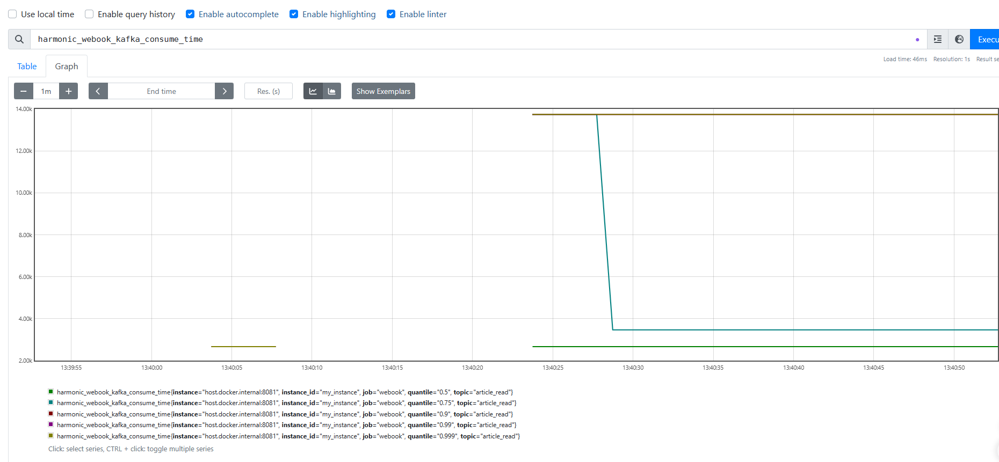
+ 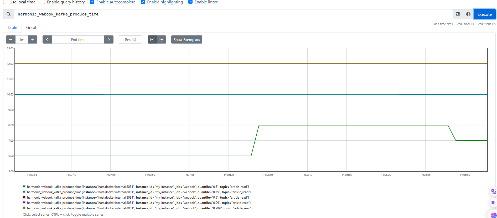

## week11

### 当没有持有锁时的UML

+ 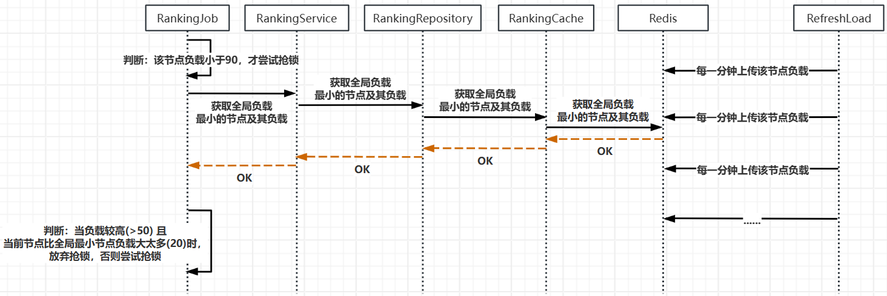

+ 每次计算 topN 前都判断当前负载是否过高(>90)，过高就释放锁并退出

### 关键URL

+ `ranking_job`:[webook/internal/job/ranking_job.go at main · harmonic-lqw/webook (github.com)](https://github.com/harmonic-lqw/webook/blob/main/internal/job/ranking_job.go)
+ `ranking_service`:[webook/internal/service/ranking_service.go at main · harmonic-lqw/webook (github.com)](https://github.com/harmonic-lqw/webook/blob/main/internal/service/ranking_service.go)
+ `ranking_repository`:[webook/internal/repository/ranking.go at main · harmonic-lqw/webook (github.com)](https://github.com/harmonic-lqw/webook/blob/main/internal/repository/ranking.go)
+ `ranking_cache`:[webook/internal/repository/cache/ranking.go at main · harmonic-lqw/webook (github.com)](https://github.com/harmonic-lqw/webook/blob/main/internal/repository/cache/ranking.go)

### 极端情况

+ 当新节点的最新负载还没有存到 redis ，导致该节点一直持有锁，知道该节点负载超过阈值。
+ 如果该节点宕机，该锁只能等到超时才会被释放，如果它的负载很高，通常不会再获得锁，如果其它原因宕机，负载低的话，它的负载很可能会持续影响其它节点获得锁。可能需要手动从 redis 中删除该节点？

## week12

### 关键URL

#### proto相关文件

+ [webook/api/proto/gen/intr/v2 at main · harmonic-lqw/webook (github.com)](https://github.com/harmonic-lqw/webook/tree/main/api/proto/gen/intr/v2)
+ [webook/api/proto/intr/v2 at main · harmonic-lqw/webook (github.com)](https://github.com/harmonic-lqw/webook/tree/main/api/proto/intr/v2)

#### server实现：interactive_repo.go

+ [webook/interactive/grpc/interactive_repo.go at main · harmonic-lqw/webook (github.com)](https://github.com/harmonic-lqw/webook/blob/main/interactive/grpc/interactive_repo.go)

#### client实现，采用课堂同样的流量控制方法：local_intr_repo.go; intr_repo.go

+ [webook/internal/client at main · harmonic-lqw/webook (github.com)](https://github.com/harmonic-lqw/webook/tree/main/internal/client)

#### 聚合位置：ArticleRepository 

+ [webook/internal/repository/article.go at main · harmonic-lqw/webook (github.com)](https://github.com/harmonic-lqw/webook/blob/main/internal/repository/article.go)

#### 在 article 对应的 handler 和 service 添加对应方法，并一路透传参数和返回值

+ 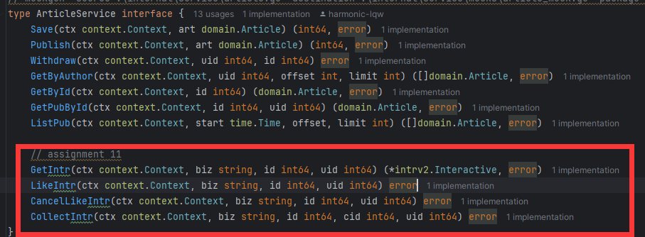
+ 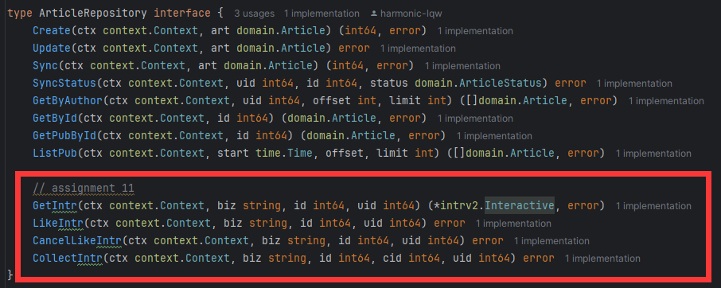

### 效果

+ 可以看到成功触发 grpc repo

+ 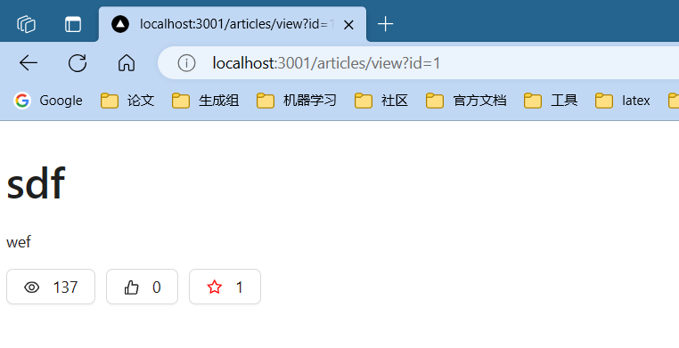

+ 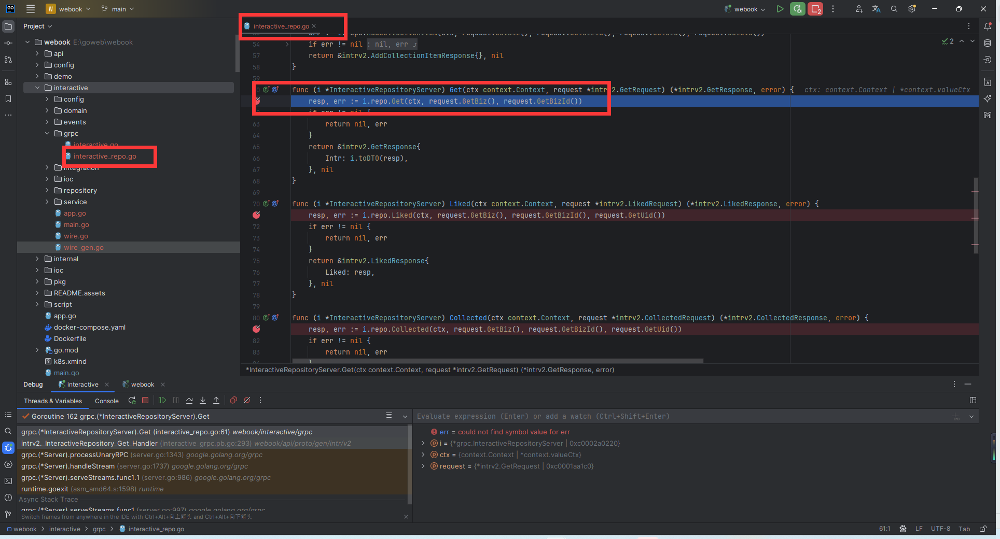

+ 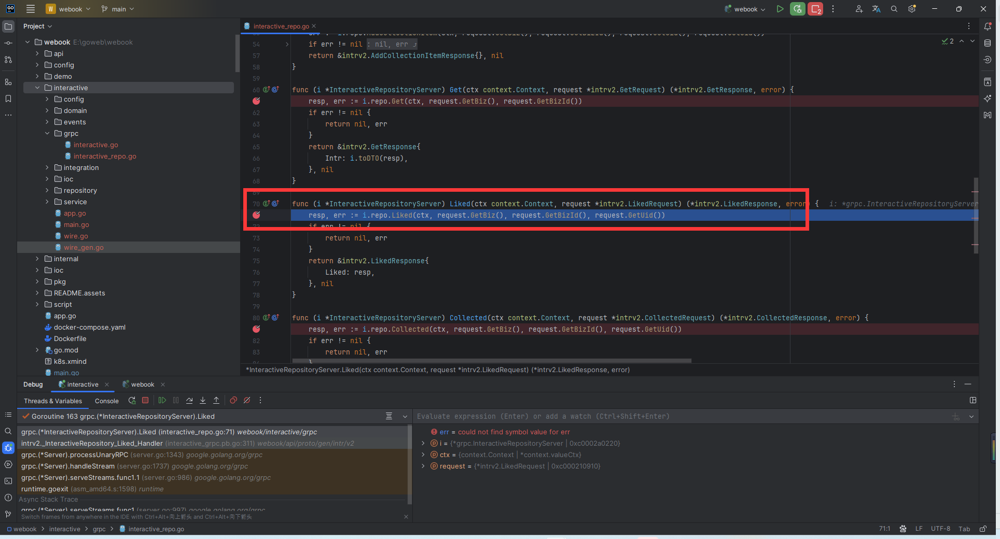

+ 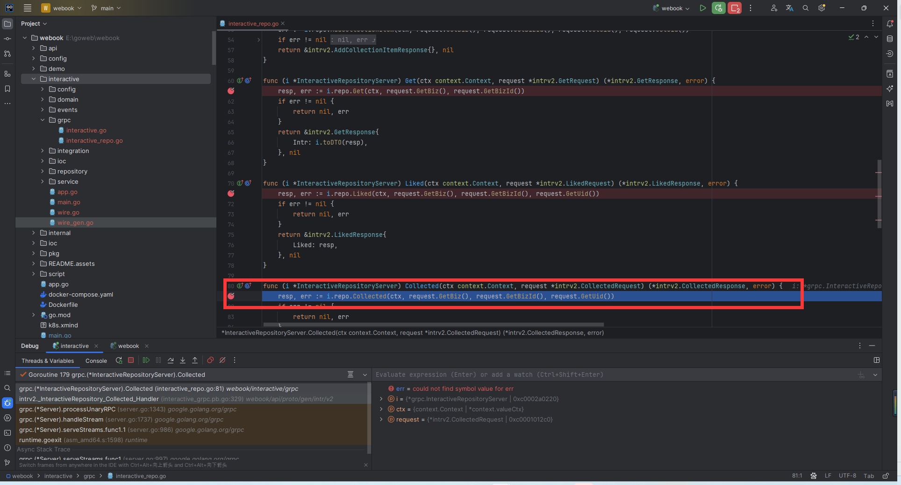

+ 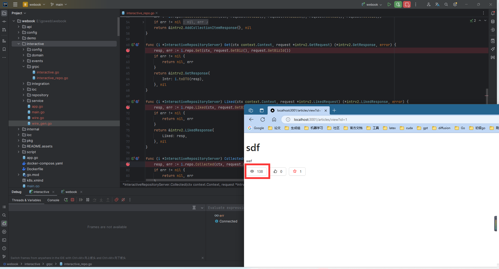

  

## week13

+ `pkg/migrator/validator/validator.go`文件下的`validateBaseToTargetBatch`方法
+ https://github.com/harmonic-lqw/webook/blob/main/pkg/migrator/validator/validator.go

## week19

+ 点赞和收藏的同步方法沿用 `InputAny()`方法
+ 
